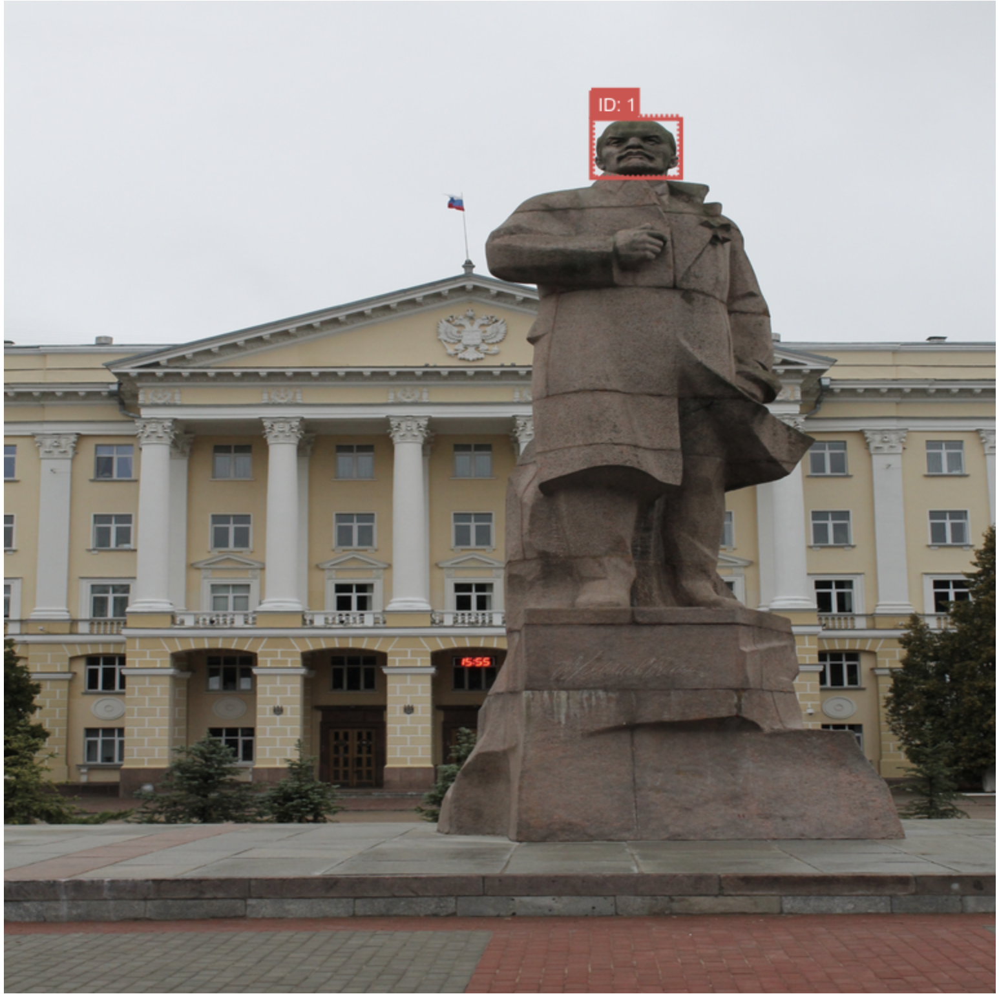
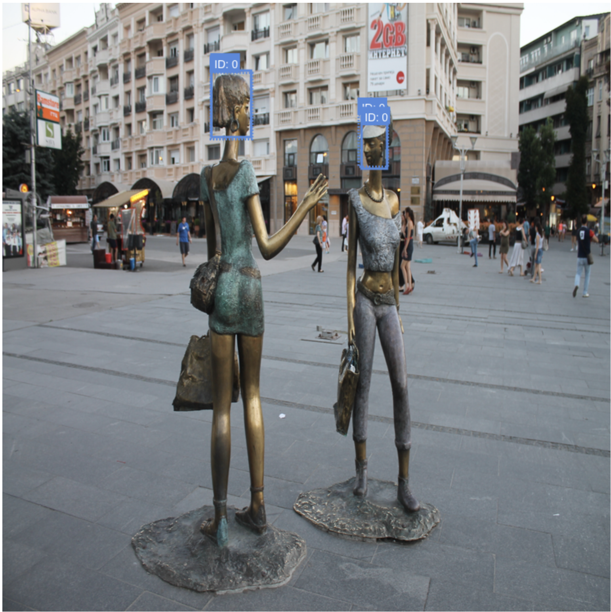
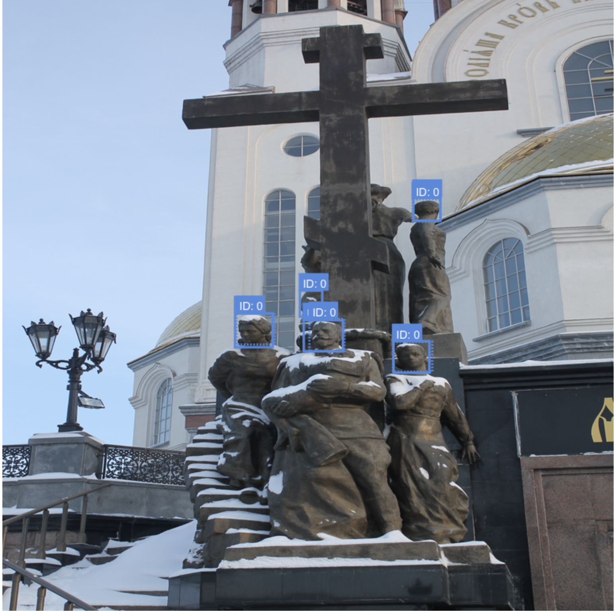

# `is_len` object detection

## Installation

Install [poetry](https://python-poetry.org) (`pip install poetry`) and run `poetry install`.
## Training
I use:
- [Wandb](https://wandb.ai) for logging/experiment tracking.
- [Hydra](https://hydra.cc/docs/intro/) for config management.
- [transformers](https://huggingface.co/docs/transformers/index) for DEIT style object detection. This model is incredibly simple conceptually, with none of the standard two-stage training/post-processing/non-maximum suppression required for object detection problems. 
- [Pytorch Lightning](https://www.pytorchlightning.ai) for multi-gpu, half precision training.
- [Albumentations](https://albumentations.ai) for data augmentation.
- [Poetry](https://python-poetry.org) for package management.
### Running train

Log into wandb to track experiments, then run `poetry run python is_len/train.py`. Dataset will be downloaded for you on first run and cached.
### Interactively running experiment

```{python}
import hydra
import pytest
from is_len import util

config = util.get_config()
datamodule = hydra.utils.instantiate(config.datamodule)
datamodule.setup()
experiment = hydra.utils.instantiate(config.experiment)

for batch in datamodule.train_dataloader():
    output = experiment(**batch)
    break
```

## Inference

Run `poetry run python is_len/inference.py infer <input_data_dir>`. Postprocessing:
- If image contains predictions of Lenin, output the box with highest probability;
- Elif image contains predictions of non-Lenin, output the box with largest area;
- Else output `{image name};0;0;1;1;0`

## Evaluation

I provide an end-to-end evaluation pipeline, based on the postprocessing describe in the 'Inference' section. It can be run as a CLI by `poetry run python is_len/inference.py evaluate`, and by default metrics are calculated on the validation set. The evaluation process is described below:

- Postprocess both labels and predictions as per above. As labels do not have an associated probability, if there are more than one true positive boxes with class `Lenin`, we choose the first. This results in a single box and class label per image.
- Calculate metrics from predicted ground-truth box/class against gold standard. The following metrics are provided per-class as well as a micro-average:
    - Accuracy: how often the class prediction matches the class label.
    - Average intersection over union ([IoU](https://medium.com/analytics-vidhya/iou-intersection-over-union-705a39e7acef)): the average intersection between predicted boxes, divided by total area of both boxes.
    - Percent IoU > 0.5: We choose `0.5` as a threshold for when a predicted box is 'good enough', based on similar judgments for standardised object detection tasks (COCO etc.). Given more time I'd want to work together with the client to empirically determine what IoU value is acceptable for the problem at hand.
    - Support: the total number of cases over which these metrics are calculated.

### Results

|               | Accuracy | Avg. IoU | % IoU > 0.5 | Support |
|---------------|----------|----------|-------------|---------|
| Lenin         | 0.82     | 0.83     | 0.94        | 68      |
| Other         | 0.52     | 0.57     | 0.68        | 65      |
| Micro average | 0.68     | 0.70     | 0.81        | 133     |

### Discussion and future work

- Overall, the model appears to be doing better at predicting the relevant bounding box (%IoU>0.5=0.81) vs class label (Accuracy=0.68). Given more time, it may be worth evaluating a two stage predictor with a separate classification head. 
- Performance for class `Other` is worse than instances of class `Lenin`. One explanation for this may be that images of `Lenin` are more standardised that the `Other` class, which may be collected from a broader geographic region and naturally contain more variance in terms of content and layout.  One other explanation is the error introduced by postprocessing – bounding box area for statues can be very similar (especially for a fixed perspective in a photograph), and so choosing the box of maximum area may introduce more error than the postprocessing for the `Lenin` case. 
- There are no instances in our validation without ground-truth statues, but three instances where our model predicted no statue. If we always expect a statue in production, we may want to alter our postprocessing so that we always predict at least one bounding box. Alternatively, if we are expecting instances in production with no statue present, we may want to alter our test set to account for this in the future.
- It would be good to understand from a product/deliverable perspective how important the post-processed output is vs. the per-box output. For future work we may want to complement the end-to-end evaluation with per-bounding box metrics as per standardised benchmarks (e.g. [COCO Object Detection Evaluation](https://blog.zenggyu.com/en/post/2018-12-16/an-introduction-to-evaluation-metrics-for-object-detection/)).

## File structure

```
project
│   README.md
│   file001.txt    
│
└───config/ # folder for yaml config files.
|
└───is_len/ # code
    │   augment.py # wrapper code for albumentations.
    │   datamodule.py # contains instances, datasets, dataloaders, datamodules.
    |   experiment.py # pytorch lightning pl.LightningModule (training logic)
    |   inference.py # CLI for inference and postprocessing.
    |   optim.py # wrapper for pl.Lightning style scheduler
    |   train.py # hydra CLI for training
    |   util.py
|
└───model/ # contains trained model
└───tests/ # tests
|   poetry.lock # lockfile
|   pyproject.toml # poetry package file
```
## Data

### Data quality comments
- The following files are not present in `statues-train/statues-other`, despite this being implied in `labels.csv`: `['Moscow_126.JPG', 'Ulyanovsk_063.JPG', 'South_Osetia_086.JPG', 'Ulyanovsk_064.JPG', 'Sofia_066.JPG', 'Moscow_512.JPG', 'Ulyanovsk_059.JPG', 'Ulaan_Baatar_209.JPG', 'Moscow_557.JPG', 'Moscow_140.JPG', 'Tirana_096.JPG', 'Budapest_06_2014_044.JPG', 'Moscow_2017_1695.jpg', 'Khabarovsk_089.JPG', 'Moscow_2017_513.jpg', 'Nizhny_Novgorod_2018_037.jpg', 'Novosibirsk_041.JPG']`.
- By investigation, this appears to occur where both `lenin` and `other` statues are present.
- We cannot in general rely on the filename to be sufficient to uniquely identify a path – `['Ulyanovsk_069.JPG', 'Moscow_2017_1408.jpg']` are present in both `statues-lenin` and `statues-other`.
- Soln: attempt to rely on labelset, if file not found then try other class folder.
- Height/width in labels file does not match with image height/width.
- There are a number of instances where image needs to be rotated for bounding boxes to line up. I make use of `exif` tags to rectify this.
## Tests

Minor unit testing added. Run `poetry run pytest tests/`.

## Examples (validation set)
Ground truth dashed line, predictions solid line.




